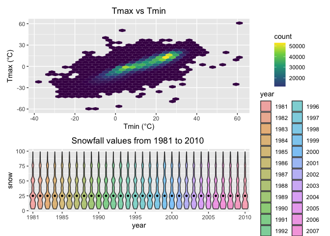

p8105_hw3_lx2346
================
linshan
2024-10-07

Before start, prepare all the packages will be used

``` r
library(ggplot2)
library(tidyverse)
```

    ## ── Attaching core tidyverse packages ──────────────────────── tidyverse 2.0.0 ──
    ## ✔ dplyr     1.1.4     ✔ readr     2.1.5
    ## ✔ forcats   1.0.0     ✔ stringr   1.5.1
    ## ✔ lubridate 1.9.3     ✔ tibble    3.2.1
    ## ✔ purrr     1.0.2     ✔ tidyr     1.3.1
    ## ── Conflicts ────────────────────────────────────────── tidyverse_conflicts() ──
    ## ✖ dplyr::filter() masks stats::filter()
    ## ✖ dplyr::lag()    masks stats::lag()
    ## ℹ Use the conflicted package (<http://conflicted.r-lib.org/>) to force all conflicts to become errors

## Problem 1

Load the data from the p8105.datasets packages

``` r
library(p8105.datasets)
data("ny_noaa")
```

### Do some exploration of the dataset.

**size and structure**: The dataset consists of 2595176 rows and 7
columns. Each row represents a daily observation for a given weather
station from 1981-01-01 to 2010-12-31.  
**Key Variables**: The variables in the dataset are id, date, prcp,
snow, snwd, tmax, tmin. **“id”** represents the unique identifier for
each weather station. **“date”** is the date of observation. **“prep”**
is precipitation(tenths of mm). **“snow”** is the snowfall(mm), while
**“snwd”** is the snow depth(mm). **“tmax”** and **“tmin”** represents
the maximum and minmum tempreture.  
\*\* Missing data\*\*: There are missing data in prcp, snow, snwd, tmax,
tmin. How many missing data are shown as below.

``` r
sapply(ny_noaa,function(x) sum(is.na(x)))
```

    ##      id    date    prcp    snow    snwd    tmax    tmin 
    ##       0       0  145838  381221  591786 1134358 1134420

So the missing value are particularly noticeable in “tmax” and “tmin”.
\### Do some data cleaning. Create separate variables for year, month,
and day. Ensure observations for temperature, precipitation, and
snowfall are given in reasonable units. separate the data variable into
year, month and day.

``` r
ny_noaa = separate(ny_noaa, date, into = c("year", "month", "day"), sep = "-", remove = FALSE)
```

change into reasonable units

``` r
ny_noaa = ny_noaa |>
  mutate(tmax = as.numeric(tmax),
         tmin = as.numeric(tmin),
         prcp = as.numeric(prcp),
         snow = as.numeric(snow),
         snwd = as.numeric(snwd)) |>
  mutate(tmax = tmax/10,
         tmin = tmin/10,
         prcp = prcp/10)
```

#### For snowfall, what are the most commonly observed values? Why?

``` r
ny_noaa |>
  count(snow) |>
  arrange(desc(n)) |>
  slice(1)
```

    ## # A tibble: 1 × 2
    ##    snow       n
    ##   <dbl>   <int>
    ## 1     0 2008508

It shows that the value 0 are most commonly observed, which is normal,
since it doesn’t snow in New York for most of the year.

### Make a two-panel plot showing the average max temperature in January and in July in each station across years.

``` r
ny_noaa |>
  filter(month == "01" | month == "07") |>
  group_by(month, id) |>
  summarize(mean_tmax = mean(tmax, na.rm = TRUE)) |>
  filter(!if_any(everything(), is.na))|>
  ggplot(aes(x = id, y = mean_tmax, color = month)) +
  geom_point() +
  facet_grid(.~ month, scale = "free_y", labeller = labeller(month = c("01" = "January", "07" = "July"))) +
  labs(
    title = " Average Maximum Temperature in January and in July",
    x = "Weather stations",
    y = "Maximum daily tempreture(C)") +
  theme(plot.title = element_text(hjust = .5), legend.position = "none")
```

    ## `summarise()` has grouped output by 'month'. You can override using the
    ## `.groups` argument.

<!-- -->

### Is there any observable / interpretable structure? Any outliers?

It can be observed that **July’s tmax is significantly higher than
January’s**, with most of July’s tmax centered around 3 degrees, while
most of January’s average temperature is centered around 0 degrees.
Among the mean maximum temperatures in January, there are three
“outliers” around -1 degree Celsius.

### Make a two-panel plot showing tmax vs tmin for the full dataset

``` r
ny_noaa |>
  pivot_longer(
    tmax:tmin,
    names_to = "ob_t",
    values_to = "tempreture"
  ) |>
  drop_na() |>
  ggplot(aes(x = date, y = tempreture, fill = ob_t)) +
  geom_bin2d(bins = 200, alpha = .8, size = 0.5, na.rm = TRUE) +
  scale_y_continuous(
    breaks = c(-20, -10, 0, 10, 20 ,30, 40),
    labels = c("-20C", "-10C","0C", "10C","20C", "30C", "40C")
  ) +
  scale_fill_discrete(name = "observations") +
  facet_grid(. ~ ob_t)
```

    ## Warning: Using `size` aesthetic for lines was deprecated in ggplot2 3.4.0.
    ## ℹ Please use `linewidth` instead.
    ## This warning is displayed once every 8 hours.
    ## Call `lifecycle::last_lifecycle_warnings()` to see where this warning was
    ## generated.

<!-- -->

### Make a plot showing the distribution of snowfall values greater than 0 and less than 100 separately by year.
