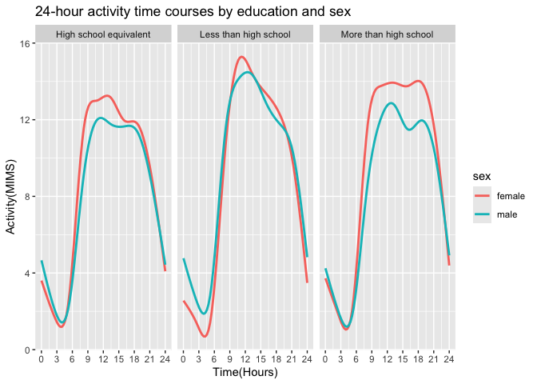

p8105_hw3_lx2346
================
linshan
2024-10-07

Before start, prepare all the packages will be used

``` r
library(ggplot2)
library(tidyverse)
```

    ## ── Attaching core tidyverse packages ──────────────────────── tidyverse 2.0.0 ──
    ## ✔ dplyr     1.1.4     ✔ readr     2.1.5
    ## ✔ forcats   1.0.0     ✔ stringr   1.5.1
    ## ✔ lubridate 1.9.3     ✔ tibble    3.2.1
    ## ✔ purrr     1.0.2     ✔ tidyr     1.3.1
    ## ── Conflicts ────────────────────────────────────────── tidyverse_conflicts() ──
    ## ✖ dplyr::filter() masks stats::filter()
    ## ✖ dplyr::lag()    masks stats::lag()
    ## ℹ Use the conflicted package (<http://conflicted.r-lib.org/>) to force all conflicts to become errors

``` r
library(readxl)
library(patchwork)
```

## Problem 1

Load the data from the p8105.datasets packages

``` r
library(p8105.datasets)
data("ny_noaa")
```

### Do some exploration of the dataset.

**size and structure**: The dataset consists of 2595176 rows and 7
columns. Each row represents a daily observation for a given weather
station from 1981-01-01 to 2010-12-31.  
**Key Variables**: The variables in the dataset are id, date, prcp,
snow, snwd, tmax, tmin. **“id”** represents the unique identifier for
each weather station. **“date”** is the date of observation. **“prep”**
is precipitation(tenths of mm). **“snow”** is the snowfall(mm), while
**“snwd”** is the snow depth(mm). **“tmax”** and **“tmin”** represents
the maximum and minmum tempreture.  
\*\* Missing data\*\*: There are missing data in prcp, snow, snwd, tmax,
tmin. How many missing data are shown as below.

``` r
sapply(ny_noaa,function(x) sum(is.na(x)))
```

    ##      id    date    prcp    snow    snwd    tmax    tmin 
    ##       0       0  145838  381221  591786 1134358 1134420

So the missing value are particularly noticeable in “tmax” and “tmin”.
\### Do some data cleaning. Create separate variables for year, month,
and day. Ensure observations for temperature, precipitation, and
snowfall are given in reasonable units. separate the data variable into
year, month and day.

``` r
ny_noaa = separate(ny_noaa, date, into = c("year", "month", "day"), sep = "-", remove = FALSE)
```

change into reasonable units

``` r
ny_noaa = ny_noaa |>
  mutate(tmax = as.numeric(tmax),
         tmin = as.numeric(tmin),
         prcp = as.numeric(prcp),
         snow = as.numeric(snow),
         snwd = as.numeric(snwd)) |>
  mutate(tmax = tmax/10,
         tmin = tmin/10,
         prcp = prcp/10)
```

#### For snowfall, what are the most commonly observed values? Why?

``` r
ny_noaa |>
  count(snow) |>
  arrange(desc(n)) |>
  slice(1)
```

    ## # A tibble: 1 × 2
    ##    snow       n
    ##   <dbl>   <int>
    ## 1     0 2008508

It shows that the value 0 are most commonly observed, which is normal,
since it doesn’t snow in New York for most of the year.

### Make a two-panel plot showing the average max temperature in January and in July in each station across years.

``` r
ny_noaa |>
  filter(month == "01" | month == "07") |>
  group_by(month, id) |>
  summarize(mean_tmax = mean(tmax, na.rm = TRUE)) |>
  filter(!if_any(everything(), is.na))|>
  ggplot(aes(x = id, y = mean_tmax, color = month)) +
  geom_point() +
  facet_grid(.~ month, scale = "free_y", labeller = labeller(month = c("01" = "January", "07" = "July"))) +
  labs(
    title = " Average Maximum Temperature in January and in July",
    x = "Weather stations",
    y = "Maximum daily tempreture(C)") +
  theme(plot.title = element_text(hjust = .5), legend.position = "none")
```

    ## `summarise()` has grouped output by 'month'. You can override using the
    ## `.groups` argument.

<!-- -->

### Is there any observable / interpretable structure? Any outliers?

It can be observed that **July’s tmax is significantly higher than
January’s**, with most of July’s tmax centered around 30 degrees, while
most of January’s average temperature is centered around 0 degrees.
Among the mean maximum temperatures in January, there are three
“outliers” around -10 degree Celsius.

### Make a two-panel plot showing i) tmax vs tmin for the full dataset；ii) distribution of snowfall values greater than 0 and less than 100 separately by year.

``` r
hex_plot = 
  ny_noaa |>
  ggplot(aes(x = tmax, y = tmin)) +
  geom_hex(bins = 30) + 
  scale_fill_viridis_c() +  
  labs(title = "Tmax vs Tmin",
       x = "Tmin (°C)",
       y = "Tmax (°C)") +
  theme(plot.title = element_text(hjust = .5))
  

violin_plot = 
  ny_noaa |>
  filter(snow > 0, snow < 100) |>
  ggplot(aes(x = year, y = snow)) + 
  geom_violin(aes(fill = year), alpha = .5) +
  scale_x_discrete(
    breaks = c(1981, 1985, 1990, 1995, 2000, 2005, 2010),
    labels = c("1981", "1985","1990", "1995","2000", "2005", "2010")
  ) +
  stat_summary(fun = "median", color = "black", size = .1) +
  labs(title = "Snowfall values from 1981 to 2010 ") +
  theme(plot.title = element_text(hjust = .5))

hex_plot / violin_plot +
  plot_layout(heights = c(3, 2))
```

    ## Warning: Removed 1136276 rows containing non-finite outside the scale range
    ## (`stat_binhex()`).

    ## Warning: Removed 30 rows containing missing values or values outside the scale range
    ## (`geom_segment()`).

<!-- -->

## Problem 2

Load the two dataset first.

``` r
demo = read_csv("./data/nhanes_covar.csv", skip = 4, na = "NA") |>
  janitor::clean_names() |>
  mutate(
    sex = 
      case_match(
        sex, 
        1 ~ "male", 
        2 ~ "female"),
    sex = as.factor(sex)) |>
  mutate(
    education = 
      case_match(
        education,
        1 ~ "Less than high school",
        2 ~ "High school equivalent",
        3 ~ "More than high school"),
    education = as.factor(education))
```

    ## Rows: 250 Columns: 5
    ## ── Column specification ────────────────────────────────────────────────────────
    ## Delimiter: ","
    ## dbl (5): SEQN, sex, age, BMI, education
    ## 
    ## ℹ Use `spec()` to retrieve the full column specification for this data.
    ## ℹ Specify the column types or set `show_col_types = FALSE` to quiet this message.

``` r
accel = read_csv("./data/nhanes_accel.csv") |>
  janitor::clean_names()
```

    ## Rows: 250 Columns: 1441
    ## ── Column specification ────────────────────────────────────────────────────────
    ## Delimiter: ","
    ## dbl (1441): SEQN, min1, min2, min3, min4, min5, min6, min7, min8, min9, min1...
    ## 
    ## ℹ Use `spec()` to retrieve the full column specification for this data.
    ## ℹ Specify the column types or set `show_col_types = FALSE` to quiet this message.

Then, merge the two data set together.

``` r
nhanes = left_join(demo,accel, by = "seqn")
```

Then, exclude participants less than 21 years of age, and those with
missing demographic data.

``` r
nhanes = filter(nhanes, age >= 21)
nhanes = filter(nhanes, !is.na(sex), !is.na(age), !is.na(bmi), !is.na(education))
nhanes
```

    ## # A tibble: 228 × 1,445
    ##     seqn sex      age   bmi education     min1   min2   min3  min4   min5   min6
    ##    <dbl> <fct>  <dbl> <dbl> <fct>        <dbl>  <dbl>  <dbl> <dbl>  <dbl>  <dbl>
    ##  1 62161 male      22  23.3 High school… 1.11  3.12   1.47   0.938 1.60   0.145 
    ##  2 62164 female    44  23.2 More than h… 1.92  1.67   2.38   0.935 2.59   5.22  
    ##  3 62169 male      21  20.1 High school… 5.85  5.18   4.76   6.48  6.85   7.24  
    ##  4 62174 male      80  33.9 More than h… 5.42  3.48   3.72   3.81  6.85   4.45  
    ##  5 62177 male      51  20.1 High school… 6.14  8.06   9.99   6.60  4.57   2.78  
    ##  6 62178 male      80  28.5 High school… 0.167 0.429  0.131  1.20  0.0796 0.0487
    ##  7 62180 male      35  27.9 More than h… 0.039 0      0      0     0.369  0.265 
    ##  8 62184 male      26  22.1 High school… 1.55  2.81   3.86   4.76  6.10   7.61  
    ##  9 62189 female    30  22.4 More than h… 2.81  0.195  0.163  0     0.144  0.180 
    ## 10 62199 male      57  28   More than h… 0.031 0.0359 0.0387 0.079 0.109  0.262 
    ## # ℹ 218 more rows
    ## # ℹ 1,434 more variables: min7 <dbl>, min8 <dbl>, min9 <dbl>, min10 <dbl>,
    ## #   min11 <dbl>, min12 <dbl>, min13 <dbl>, min14 <dbl>, min15 <dbl>,
    ## #   min16 <dbl>, min17 <dbl>, min18 <dbl>, min19 <dbl>, min20 <dbl>,
    ## #   min21 <dbl>, min22 <dbl>, min23 <dbl>, min24 <dbl>, min25 <dbl>,
    ## #   min26 <dbl>, min27 <dbl>, min28 <dbl>, min29 <dbl>, min30 <dbl>,
    ## #   min31 <dbl>, min32 <dbl>, min33 <dbl>, min34 <dbl>, min35 <dbl>, …

### Produce a reader-friendly table for the number of men and women in each education category

``` r
nhanes |>
  group_by(sex,education) |>
  summarize(count = n()) |>
  pivot_wider(
    names_from = "education",
    values_from = "count"
  ) |>
  knitr::kable()
```

    ## `summarise()` has grouped output by 'sex'. You can override using the `.groups`
    ## argument.

| sex    | High school equivalent | Less than high school | More than high school |
|:-------|-----------------------:|----------------------:|----------------------:|
| female |                     23 |                    28 |                    59 |
| male   |                     35 |                    27 |                    56 |

### Create a visualization of the age distributions for men and women in each education category.

``` r
nhanes |>
  group_by(sex,education) |>
  ggplot(aes(x = education, y = age, color = education)) +
  geom_boxplot() +
  facet_grid(. ~ sex ) +
  theme(axis.text.x = element_text(angle = 45, vjust = 1, hjust = 1))
```

<!-- -->  
**Comment**: It can be seen that the age distribution of the males and
females who participated in the accelerometers survey was similar
according to their level of education, with subjects whose education was
more than high school being younger, around 40-60 years old, and those
whose education was high school equivalent or more than high school
being mostly between 45-70 years old.  

### Analyses of accelerometer data

#### Create a total activity variable

``` r
nhanes = mutate(nhanes, total_activity = rowSums(select(nhanes, 6:1445)))
nhanes = select(nhanes, seqn, sex, age, bmi, education, total_activity, everything())
```

#### Plot these total activities (y-axis) against age (x-axis); compare men to women and have separate panels for each education level. Include a trend line or a smooth to illustrate differences.

``` r
nhanes |>
  group_by(sex,education) |>
  ggplot(aes(x = age, y = total_activity, colour = sex)) +
  geom_point(alpha = .5, size = 1.5) +
  geom_smooth(se = FALSE, size = 1) +
  facet_grid(. ~ education)
```

    ## Warning: Using `size` aesthetic for lines was deprecated in ggplot2 3.4.0.
    ## ℹ Please use `linewidth` instead.
    ## This warning is displayed once every 8 hours.
    ## Call `lifecycle::last_lifecycle_warnings()` to see where this warning was
    ## generated.

    ## `geom_smooth()` using method = 'loess' and formula = 'y ~ x'

<!-- -->  
**Comment**: It can be seen that the highest intensity of total activity
occurs at different ages at different levels of education, with the
highest activity occurring at roughly age 40 among participants in the
high school equivalent, and with female having higher total activity
than male. In contrast, among participants less than high school,
females had higher total activity than males up to age 40, and the
opposite was true after age 40. Their highest total activity occurred at
a later age of 60. Among participants from more than high school, their
total activity curves were smoother and peaked at different ages for
males and females, around 45 years for males and 60 years for females.

### Make a three-panel plot that shows the 24-hour activity time courses for each education level and use color to indicate sex.

``` r
nhanes |>
  pivot_longer(
    min1:min1440,
    names_to = "time",
    values_to = "activity",
    names_prefix = "min"
  ) |>
  mutate(time = as.numeric(time)) |>
  mutate(time = time/60) |>
  group_by(education, sex) |>
  ggplot(aes(x = time, y = activity, color = sex)) +
  geom_smooth(se = FALSE) +
  facet_grid(. ~ education) +
  labs(title = "24-hour activity time courses by education and sex",
       x = "Time(Hours)",
       y = "Activity(MIMS)") +
  scale_x_continuous(breaks = seq(0, 24, by = 3))
```

    ## `geom_smooth()` using method = 'gam' and formula = 'y ~ s(x, bs = "cs")'

<!-- -->  
**Comment**：Looking at the curves in the three pairs of images, it can
be seen that, regardless of education level, participants had higher
activity intensities during the day from 9 am to 6 pm, and the lowest
activity intensities (at the nadir) at around 4 am. In the high school
equivalent and less than high school groups, there was no significant
difference in the distribution of activity intensity between males and
females over the 24-hour period. In the More than High school group, a
small low peak for males around 4 p.m. and a lower activity intensity
curve for males below that of females can be observed.

## Probelm 3

First of all, load all the data needed.

``` r
jan_20 = read_csv("./citibike/Jan 2020 Citi.csv") |>
  janitor::clean_names() |>
  mutate(year = 2020, month = 1)
```

    ## Rows: 12420 Columns: 7
    ## ── Column specification ────────────────────────────────────────────────────────
    ## Delimiter: ","
    ## chr (6): ride_id, rideable_type, weekdays, start_station_name, end_station_n...
    ## dbl (1): duration
    ## 
    ## ℹ Use `spec()` to retrieve the full column specification for this data.
    ## ℹ Specify the column types or set `show_col_types = FALSE` to quiet this message.

``` r
jan_24 = read_csv("./citibike/Jan 2024 Citi.csv") |>
  janitor::clean_names() |>
    mutate(year = 2024, month = 1)
```

    ## Rows: 18861 Columns: 7
    ## ── Column specification ────────────────────────────────────────────────────────
    ## Delimiter: ","
    ## chr (6): ride_id, rideable_type, weekdays, start_station_name, end_station_n...
    ## dbl (1): duration
    ## 
    ## ℹ Use `spec()` to retrieve the full column specification for this data.
    ## ℹ Specify the column types or set `show_col_types = FALSE` to quiet this message.

``` r
july_20 = read_csv("./citibike/July 2020 Citi.csv") |>
  janitor::clean_names() |>
    mutate(year = 2020, month = 7)
```

    ## Rows: 21048 Columns: 7
    ## ── Column specification ────────────────────────────────────────────────────────
    ## Delimiter: ","
    ## chr (6): ride_id, rideable_type, weekdays, start_station_name, end_station_n...
    ## dbl (1): duration
    ## 
    ## ℹ Use `spec()` to retrieve the full column specification for this data.
    ## ℹ Specify the column types or set `show_col_types = FALSE` to quiet this message.

``` r
july_24 = read_csv("./citibike/July 2024 Citi.csv") |>
  janitor::clean_names() |>
  mutate(year = 2024, month = 7)
```

    ## Rows: 47156 Columns: 7
    ## ── Column specification ────────────────────────────────────────────────────────
    ## Delimiter: ","
    ## chr (6): ride_id, rideable_type, weekdays, start_station_name, end_station_n...
    ## dbl (1): duration
    ## 
    ## ℹ Use `spec()` to retrieve the full column specification for this data.
    ## ℹ Specify the column types or set `show_col_types = FALSE` to quiet this message.

Combine the 4 datasets

``` r
citibike = bind_rows(jan_20, jan_24, july_20, july_24)
citibike
```

    ## # A tibble: 99,485 × 9
    ##    ride_id   rideable_type weekdays duration start_station_name end_station_name
    ##    <chr>     <chr>         <chr>       <dbl> <chr>              <chr>           
    ##  1 4BE06CB3… classic_bike  Tuesday     15.3  Columbus Ave & W … E 53 St & Madis…
    ##  2 26886E03… classic_bike  Wednesd…     5.31 2 Ave & E 96 St    1 Ave & E 110 St
    ##  3 24DC5606… classic_bike  Friday       9.69 Columbia St & Riv… Grand St & Eliz…
    ##  4 EEDC1053… classic_bike  Sunday       7.00 W 84 St & Columbu… Columbus Ave & …
    ##  5 2CD4BD4C… classic_bike  Friday       2.85 Forsyth St & Broo… Suffolk St & St…
    ##  6 E18682F9… classic_bike  Sunday      25.5  Allen St & Hester… Atlantic Ave & …
    ##  7 B9B2E896… classic_bike  Sunday       3.65 Lafayette St & Je… Washington Pl &…
    ##  8 DEF8F504… classic_bike  Sunday      38.3  28 Ave & 44 St     Broadway & Kosc…
    ##  9 17D44DA9… classic_bike  Thursday    38.5  Barrow St & Hudso… Emerson Pl & My…
    ## 10 0FD113A3… classic_bike  Tuesday      6.52 Carlton Ave & Par… Emerson Pl & My…
    ## # ℹ 99,475 more rows
    ## # ℹ 3 more variables: member_casual <chr>, year <dbl>, month <dbl>

### Describe the resulting data set.

I first imported the data from the four data tables, and in order not to
mix them up after the merge, I added the variables year and month to
each table. **size and structure**: The dataset consists of 99485 rows
and 9 columns. Each row represents a record of bike riding less than 4
hours.  
**Key Variables**: The variables in the dataset are id, date, year,
month, day, prcp, snow, snwd, tmax, tmin.

### Produce a reader-friendly table showing the total number of rides in each combination of year and month separating casual riders and Citi Bike members.

``` r
citibike |>
  group_by(year, month, member_casual) |>
  summarize(total_number = n()) |>
  pivot_wider(
    names_from = "member_casual",
    values_from = "total_number"
  ) |>
  knitr::kable()
```

    ## `summarise()` has grouped output by 'year', 'month'. You can override using the
    ## `.groups` argument.

| year | month | casual | member |
|-----:|------:|-------:|-------:|
| 2020 |     1 |    984 |  11436 |
| 2020 |     7 |   5637 |  15411 |
| 2024 |     1 |   2108 |  16753 |
| 2024 |     7 |  10894 |  36262 |

  
**Comment**: The majority of people who use citibike are citibike
**MEMBERS**, with significantly fewer CASUAL users than MEMBERS. The
total number of people who chose citibike in July was greater than in
January. And about three times as many people in July (2020 and 2024)
MEMBERS use citibike as CASUAL.

### Make a table showing the 5 most popular starting stations for July 2024; include the number of rides originating from these stations.

``` r
july_24 |>
  group_by(start_station_name) |>
  summarize(station_times = n()) |>
  mutate(start_station_rank = min_rank(desc(station_times))) |>
  filter(start_station_rank < 6) |>
  arrange(start_station_rank) |>
  knitr::kable()
```

| start_station_name       | station_times | start_station_rank |
|:-------------------------|--------------:|-------------------:|
| Pier 61 at Chelsea Piers |           163 |                  1 |
| University Pl & E 14 St  |           155 |                  2 |
| W 21 St & 6 Ave          |           152 |                  3 |
| West St & Chambers St    |           150 |                  4 |
| W 31 St & 7 Ave          |           146 |                  5 |

### Make a plot to investigate the effects of day of the week, month, and year on median ride duration.

``` r
citibike |>
  group_by(month,year,weekdays) |>
  summarize(median_duration = median(duration, na.rm = TRUE)) |>
  mutate(weekdays = as.factor(weekdays)) |>
  mutate(weekdays = forcats::fct_relevel(weekdays, c("Monday", "Tuesday", "Wednesday", "Thursday", "Friday", "Saturday", "Sunday"))) |>
  ggplot(aes(x = weekdays, y = median_duration, fill = weekdays)) +
  geom_bar(stat = "identity", position = position_dodge(), alpha = .8) +
  geom_text(aes(label = sprintf("%.2f", median_duration)), vjust = -0.5, color = "black", size = 2.5) +
  facet_grid(month ~ year, labeller = labeller(month = c("1" = "January", "7" = "July"))) +
  viridis::scale_fill_viridis(discrete = TRUE) +
  theme(axis.text.x = element_text(angle = 45, vjust = 1, hjust = 1))
```

    ## `summarise()` has grouped output by 'month', 'year'. You can override using the
    ## `.groups` argument.

<!-- -->  
**Comment**:It can be noticed that in terms of citibike usage, 2024 is
used less than 2020. In the same year, July is used more than January.
In the same month, weekend usage is greater than weekday usage.

### For data in 2024, make a figure that shows the impact of month, membership status, and bike type on the distribution of ride duration.

``` r
citibike |>
  filter(year == 2024) |>
  mutate(month = as.factor(month)) |>
  group_by(month, member_casual, rideable_type) |>
  ggplot(aes(x = month, y = duration, fill = month)) +
  geom_violin(alpha = .8) +
  scale_y_sqrt() +
  scale_y_continuous(
    breaks = c(10, 25, 50, 100, 150, 200, 250),
    labels = c("10","25","50", "100", "150", "200", "250")
  ) +
  stat_summary(fun = "median", color = "black", size = .1) +
  scale_x_discrete(breaks = c("1", "7"), 
                     labels = c("January", "July")) +
  facet_grid(rideable_type ~ member_casual) +
  labs(title = " Duration time by Month, Membership Status, and Bike Type") +
  theme(plot.title = element_text(hjust = .5), legend.position = "none")
```

    ## Scale for y is already present.
    ## Adding another scale for y, which will replace the existing scale.

    ## Warning: Removed 2 rows containing missing values or values outside the scale range
    ## (`geom_segment()`).
    ## Removed 2 rows containing missing values or values outside the scale range
    ## (`geom_segment()`).
    ## Removed 2 rows containing missing values or values outside the scale range
    ## (`geom_segment()`).
    ## Removed 2 rows containing missing values or values outside the scale range
    ## (`geom_segment()`).

<!-- -->  
**Comment**: The violin plot shows that the time spent riding is mainly
concentrated less than 50 minutes, and the median is mostly clustered
around 10. This indicates that the time that people spend cycling is
basically concentrated around 10 minutes, but there are some people who
will ride for a very long time( more than 200 minutes), which leads to
the upper part of the violin plot being particularly thin. Comparing the
shape of the violin plot reveals that the amount of time MEMBER spends
cycling is more concentrated in shorter areas. And July has more people
riding for longer periods of time compared to January.
